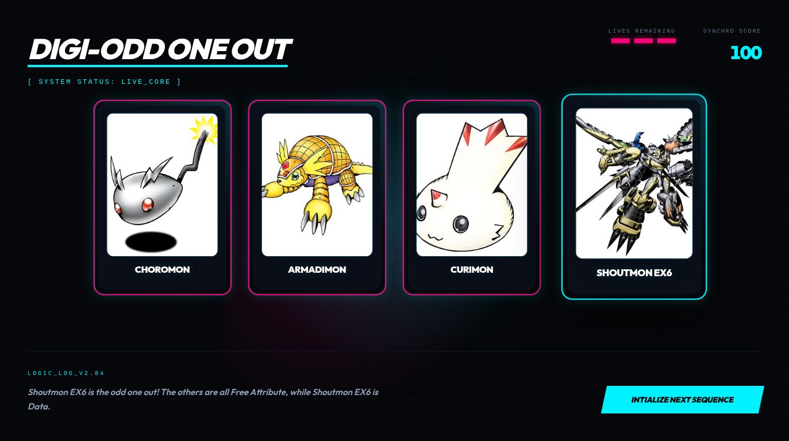

# Digi‑Odd One Out (Svelte)



**Digi‑Odd One Out** is an interactive web puzzle game where you pick the “odd” Digimon card out of four. Each round is generated from Digimon lore data (Attribute, Level, Type, Field): **three cards share a value** and **one differs**.

This Svelte app uses **SvelteKit + Vite**, **Threlte/Three.js** for a 3D vibe, **Tailwind CSS**, and **SQLite (better-sqlite3) via Drizzle** for local persistence.

## Quickstart

From the `svelte/` directory:

```sh
pnpm install
pnpm dev
```

Then open the URL printed in the terminal (usually `http://localhost:5173`).

### Common scripts

```sh
# dev server
pnpm dev

# typecheck
pnpm check

# lint / format
pnpm lint
pnpm format

# production build + local preview
pnpm build
pnpm preview
```

### Database (optional)

If you’re using the local SQLite database via Drizzle:

```sh
pnpm db:push
# pnpm db:migrate
# pnpm db:studio
```

## Project notes

- **Game loop**: deal → guess → reveal → repeat until out of lives.
- **Content**: puzzles are driven by Digimon properties (Attribute/Level/Type/Field).

## Thanks

Digimon data is sourced from [DAPI: Digimon API](https://digi-api.com). Thank you for providing and maintaining the database.
